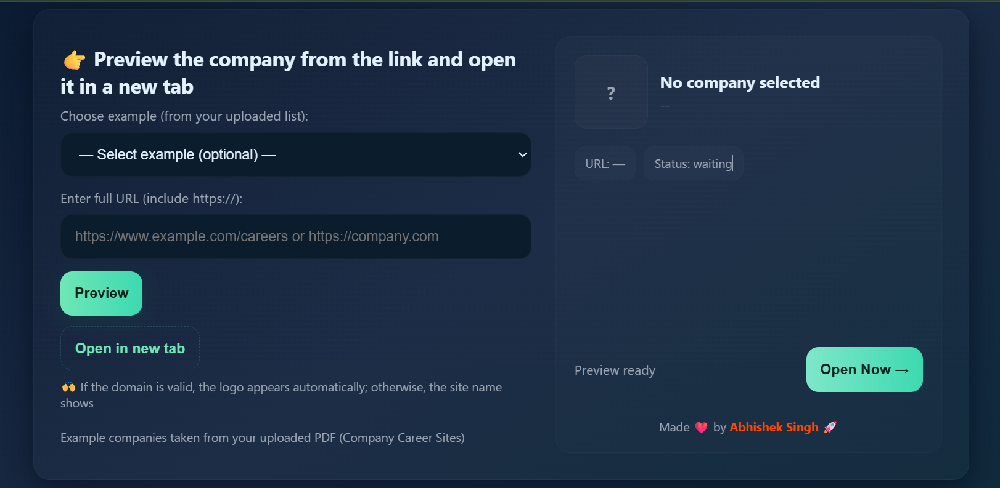

# Link Preview — Company Logo & Open in New Tab


> *A sleek, responsive web app to preview any company career link with auto logo detection and one-click open in new tab.*

---

## Features

- **Auto Logo Detection** – Uses [Clearbit Logo API](https://clearbit.com/logo) with Google Favicon fallback
- **Smart Company Name** – Extracts clean company name from domain (e.g., `careers.google.com` → `Google`)
- **Responsive Design** – Works perfectly on mobile, tablet, and desktop
- **Preloaded Examples** – 200+ company career links (from your PDF list)
- **One-Click Open** – Opens link in new tab with security (`noopener, noreferrer`)
- **Touch-Friendly** – Minimum 44px tap targets
- **No Backend** – Pure HTML, CSS, JavaScript (works offline after load)

---

## Live Demo

[Open Live App](https://carrer-page.netlify.app/) 

---

## How to Use

1. **Select from dropdown** – Choose any company from the list
2. **Or paste a URL** – Must include `https://`
3. Click **"Preview"**
4. Click **"Open Now"** to visit in new tab

> Logo appears automatically if domain is valid. Otherwise, first letter of company name shows.

---

## Tech Stack

- HTML5
- CSS3 (Flexbox, Grid, Responsive Units, Clamp)
- Vanilla JavaScript
- [Clearbit Logo API](https://clearbit.com/logo)
- Google Favicon API

---

## Setup Locally

```bash
git clone https://github.com/Abhishek-Singh2003/link-preview-company.git
cd link-preview-company
